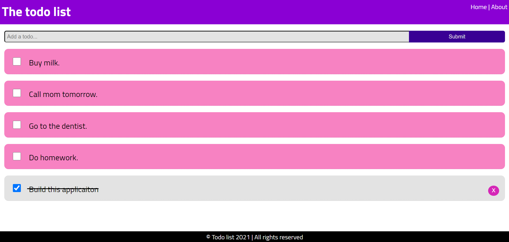

# Angular-todo-list

This project was created as an exercise to get familiar with angular and some of its features like fetching data asynchronosly and navigation.

## Functionalities

-**view all not done todos**  
-**mark a todo as done**  
-**add a todo**  
-**remove a todo**  
-**update a todo**

## How to use it

-**clone the repo https://github.com/Danijela2019/angular-todo-list.git**  
-**instal all dependencies by runnig 'npm install'in the terminal**  
-**start the application by typing 'ng serve' in the terminal**  
-**view the app on localhost 4200**
